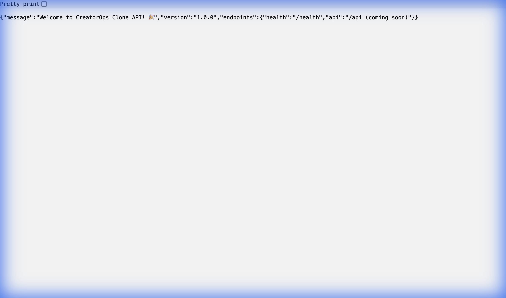
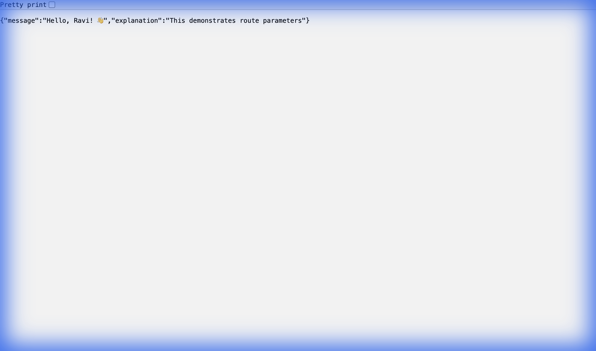

# 🏗️ PHASE 1: Foundation

> **Goal**: Build a basic Express server from scratch and understand every single line.

---

## 📚 THE BIG PICTURE: What Are We Building?

Before writing any code, let's understand the **mental model**.

### What is a "Backend"?

Think of a restaurant:

```
┌─────────────────────────────────────────────────────────────────────────────┐
│                          RESTAURANT ANALOGY                                   │
├─────────────────────────────────────────────────────────────────────────────┤
│                                                                               │
│    Customer                  Waiter                  Kitchen                  │
│    (Browser)                (Server)                (Database)                │
│                                                                               │
│    ┌─────────┐              ┌─────────┐             ┌─────────┐              │
│    │   You   │   "I want    │ Express │  "Get me    │ MongoDB │              │
│    │         │──── pizza" ──▶│         │── pizza" ──▶│         │              │
│    │         │              │         │             │         │              │
│    │         │◀── 🍕 ────── │         │◀── 🍕 ──────│         │              │
│    └─────────┘              └─────────┘             └─────────┘              │
│                                                                               │
└─────────────────────────────────────────────────────────────────────────────┘
```

**The Backend (Server) is the waiter:**
- Takes orders (HTTP Requests)
- Talks to the kitchen (Database)
- Brings food back (HTTP Response)

### Why Do We Need a Backend?

Without a backend:
- ❌ Data disappears when you refresh the page
- ❌ Everyone sees only their own data (no sharing)
- ❌ Anyone can fake/modify data (no security)
- ❌ Can't send emails, process payments, etc.

With a backend:
- ✅ Data is stored permanently (database)
- ✅ Multiple users share same data (centralized)
- ✅ Server validates and protects data (security)
- ✅ Can integrate with any external service

---

## 📚 CONCEPT 1: What is HTTP?

HTTP = **H**yper**T**ext **T**ransfer **P**rotocol

It's the **language** browsers and servers use to talk.

### The HTTP Request-Response Cycle

```
┌─────────────────────────────────────────────────────────────────────────────┐
│                     HTTP REQUEST-RESPONSE CYCLE                               │
├─────────────────────────────────────────────────────────────────────────────┤
│                                                                               │
│   BROWSER                               SERVER                                │
│   ────────                               ──────                                │
│                                                                               │
│   ┌──────────────────┐                   ┌──────────────────┐                │
│   │                  │    1. REQUEST     │                  │                │
│   │  "Give me the    │ ────────────────▶ │  Receives        │                │
│   │   deals page"    │                   │  request         │                │
│   │                  │                   │                  │                │
│   │                  │    2. RESPONSE    │  Processes &     │                │
│   │  Renders data    │ ◀──────────────── │  sends back      │                │
│   │  on screen       │                   │                  │                │
│   └──────────────────┘                   └──────────────────┘                │
│                                                                               │
│   REQUEST contains:                      RESPONSE contains:                   │
│   • Method (GET, POST...)                • Status Code (200, 404...)          │
│   • URL (/api/deals)                     • Headers                            │
│   • Headers (auth token)                 • Body (JSON data)                   │
│   • Body (for POST)                                                           │
│                                                                               │
└─────────────────────────────────────────────────────────────────────────────┘
```

### HTTP Methods (Verbs)

These tell the server **what action** you want:

| Method | Purpose | Restaurant Analogy |
|--------|---------|-------------------|
| **GET** | Read/fetch data | "Show me the menu" |
| **POST** | Create new data | "I'll have the pizza" |
| **PATCH** | Update part of data | "Add extra cheese" |
| **PUT** | Replace entire data | "Actually, replace my whole order" |
| **DELETE** | Remove data | "Cancel my order" |

### HTTP Status Codes

These tell the browser **what happened**:

```
┌─────────────────────────────────────────────────────────────────────────────┐
│                          HTTP STATUS CODES                                    │
├─────────────────────────────────────────────────────────────────────────────┤
│                                                                               │
│   2xx = SUCCESS (Green light! ✅)                                             │
│   ├── 200 OK            → Request successful                                  │
│   ├── 201 Created       → New resource created                                │
│   └── 204 No Content    → Success, nothing to return                          │
│                                                                               │
│   4xx = CLIENT ERROR (Your fault! ❌)                                         │
│   ├── 400 Bad Request   → Invalid data sent                                   │
│   ├── 401 Unauthorized  → Not logged in                                       │
│   ├── 403 Forbidden     → Logged in, but not allowed                          │
│   └── 404 Not Found     → Resource doesn't exist                              │
│                                                                               │
│   5xx = SERVER ERROR (Our fault! 💥)                                          │
│   └── 500 Internal Error → Server crashed/bug                                 │
│                                                                               │
└─────────────────────────────────────────────────────────────────────────────┘
```

---

## 📚 CONCEPT 2: What is Node.js?

### The Problem Before Node.js

JavaScript was created in 1995 to run ONLY in browsers.

```
1995-2009
─────────────────────────────────────────────────────────
Browser: JavaScript ✅
Server:  PHP, Java, Python, Ruby (NO JavaScript ❌)
─────────────────────────────────────────────────────────
```

Developers had to learn 2 languages: JavaScript for frontend, something else for backend.

### The Solution: Node.js (2009)

Ryan Dahl thought: *"What if JavaScript could run outside the browser?"*

He took Chrome's V8 JavaScript engine and added:
- File system access
- Network capabilities
- OS-level features

```
2009-Now
─────────────────────────────────────────────────────────
Browser: JavaScript ✅
Server:  Node.js (JavaScript!) ✅
─────────────────────────────────────────────────────────
```

**Result**: Use JavaScript EVERYWHERE!

### What Node.js IS and ISN'T

```
┌─────────────────────────────────────────────────────────────────────────────┐
│                          WHAT IS NODE.JS?                                     │
├─────────────────────────────────────────────────────────────────────────────┤
│                                                                               │
│   Node.js IS:                           Node.js IS NOT:                       │
│   ───────────                           ────────────────                       │
│   • A JavaScript runtime                • A programming language              │
│   • Built on Chrome's V8 engine         • A framework                         │
│   • Event-driven, non-blocking          • A library                           │
│   • Great for I/O-heavy tasks           • Good for CPU-heavy tasks            │
│                                                                               │
│   Think of it like:                                                           │
│   • JavaScript = the language                                                  │
│   • Node.js = the environment that runs JavaScript outside browser            │
│                                                                               │
└─────────────────────────────────────────────────────────────────────────────┘
```

---

## 📚 CONCEPT 3: What is Express.js?

### Raw Node.js is Painful

You CAN build a server with just Node.js:

```javascript
// ❌ Raw Node.js - TOO MUCH WORK!
const http = require('http');

const server = http.createServer((req, res) => {
    // Parse URL yourself
    const url = req.url;
    
    // Parse method yourself
    const method = req.method;
    
    // Parse body yourself (comes in chunks!)
    let body = '';
    req.on('data', chunk => body += chunk);
    req.on('end', () => {
        // Handle routing yourself
        if (method === 'GET' && url === '/') {
            res.writeHead(200, {'Content-Type': 'text/plain'});
            res.end('Home');
        } else if (method === 'GET' && url === '/about') {
            res.writeHead(200, {'Content-Type': 'text/plain'});
            res.end('About');
        }
        // ... 50 more conditions 😱
    });
});

server.listen(3000);
```

### Express.js Makes It Easy

Express is a **framework** = pre-built code that handles the boring stuff.

```javascript
// ✅ Express.js - CLEAN AND SIMPLE!
const express = require('express');
const app = express();

app.get('/', (req, res) => res.send('Home'));
app.get('/about', (req, res) => res.send('About'));

app.listen(3000);
```

**Express gives you:**
- 🛣️ **Routing** - Map URLs to functions
- 🔧 **Middleware** - Reusable request processing
- 📦 **Body parsing** - Automatic JSON handling
- 📤 **Response helpers** - .json(), .status(), .redirect()

---

## 📚 CONCEPT 4: What is a Port?

Your computer can run many programs that use the network. How does it know which program should receive which data?

**Answer: Ports!**

```
┌─────────────────────────────────────────────────────────────────────────────┐
│                          PORTS EXPLAINED                                      │
├─────────────────────────────────────────────────────────────────────────────┤
│                                                                               │
│   Think of your computer as an APARTMENT BUILDING                             │
│                                                                               │
│   IP Address = Building Address (192.168.1.1)                                │
│   Port = Apartment Number (5001)                                              │
│                                                                               │
│   ┌─────────────────────────────────────────┐                                │
│   │           YOUR COMPUTER                  │                                │
│   │                                          │                                │
│   │   Port 80   → Web Server (HTTP)         │                                │
│   │   Port 443  → HTTPS                      │                                │
│   │   Port 3000 → React Dev Server          │                                │
│   │   Port 5001 → Your Express API ⬅️        │                                │
│   │   Port 27017 → MongoDB                   │                                │
│   │                                          │                                │
│   └─────────────────────────────────────────┘                                │
│                                                                               │
│   URL: localhost:5001/api/deals                                               │
│        ─────────┬────┬─────────                                               │
│             host│port│ path                                                   │
│                                                                               │
└─────────────────────────────────────────────────────────────────────────────┘
```

---

## 🔨 BUILD TIME: Let's Create Our Server!

Now that you understand the concepts, let's build!

### Step 1.1: Initialize the Project

First, we need to create a `package.json` file. This file:
- Lists your project's dependencies
- Contains scripts to run your project
- Has metadata about your project

```bash
cd creatorops-clone/server
npm init -y
```

**What this does:**
- `npm` = Node Package Manager (comes with Node.js)
- `init` = Initialize a new project
- `-y` = Say "yes" to all defaults

### Step 1.2: Install Dependencies

We need 5 packages:

| Package | Purpose |
|---------|---------|
| `express` | Web framework |
| `mongoose` | MongoDB ODM |
| `cors` | Cross-origin requests |
| `helmet` | Security headers |
| `dotenv` | Environment variables |

```bash
npm install express mongoose cors helmet dotenv
```

### Step 1.3: Create the Server File

Create `server.js` - this is the **entry point** of your backend.

I'll pause here and let you type this yourself. I'll explain each line after!

---

## ⏸️ PAUSE POINT 1

Before I give you the code, let me ask:

1. **Are the concepts clear so far?** (HTTP, Node.js, Express, Ports)
2. **Do you want to continue to the code part?**

Reply **"CONTINUE"** when you're ready for the server.js code with line-by-line explanation!

---

## ✅ CHECKPOINT COMPLETE!

Your server is running and responding correctly!

### Screenshot: Root Endpoint (`/`)


### Screenshot: Hello Endpoint (`/hello/Ravi`)  


### What We Built:

```
creatorops-clone/
└── server/
    ├── package.json      ✅ Project configuration
    ├── package-lock.json ✅ Dependency lock file
    ├── node_modules/     ✅ Installed packages
    ├── .env              ✅ Environment variables
    └── server.js         ✅ Main server file
```

### Endpoints Working:

| Endpoint | Method | Response |
|----------|--------|----------|
| `/` | GET | Welcome message + API info |
| `/health` | GET | Status + timestamp |
| `/hello/:name` | GET | Personalized greeting |
| `/echo` | POST | Echoes back sent data |

---

## 📝 PHASE 1: Complete Revision Notes

```
╔═══════════════════════════════════════════════════════════════════════════════╗
║                    PHASE 1: FOUNDATION - REVISION NOTES                        ║
╠═══════════════════════════════════════════════════════════════════════════════╣
║                                                                                ║
║  HTTP (HyperText Transfer Protocol)                                            ║
║  ───────────────────────────────────                                           ║
║  • Language that browsers and servers use to communicate                       ║
║  • Request-Response cycle: Client sends request → Server sends response        ║
║                                                                                ║
║  HTTP METHODS                                                                  ║
║  ─────────────                                                                 ║
║  • GET    = Read/fetch data        (show me the menu)                          ║
║  • POST   = Create new data        (I'll have pizza)                           ║
║  • PATCH  = Update part of data    (add extra cheese)                          ║
║  • PUT    = Replace entire data    (replace my whole order)                    ║
║  • DELETE = Remove data            (cancel my order)                           ║
║                                                                                ║
║  STATUS CODES                                                                  ║
║  ────────────                                                                  ║
║  • 2xx = Success (200 OK, 201 Created)                                         ║
║  • 4xx = Client error (400 Bad Request, 401 Unauthorized, 404 Not Found)       ║
║  • 5xx = Server error (500 Internal Server Error)                              ║
║                                                                                ║
║  NODE.JS                                                                       ║
║  ───────                                                                       ║
║  • JavaScript runtime for server-side                                          ║
║  • Built on Chrome's V8 engine                                                 ║
║  • Event-driven, non-blocking I/O                                              ║
║  • NOT a language, NOT a framework - it's a runtime                            ║
║                                                                                ║
║  EXPRESS.JS                                                                    ║
║  ──────────                                                                    ║
║  • Web framework built on Node.js                                              ║
║  • Handles routing, middleware, response helpers                               ║
║  • Makes building APIs easy compared to raw Node.js                            ║
║                                                                                ║
║  PORT                                                                          ║
║  ────                                                                          ║
║  • "Apartment number" for network traffic                                      ║
║  • Each application listens on a specific port                                 ║
║  • Our API: localhost:5001                                                     ║
║                                                                                ║
║  MIDDLEWARE                                                                    ║
║  ──────────                                                                    ║
║  • Functions that run BETWEEN request and response                             ║
║  • express.json() → parses JSON body → req.body                                ║
║  • cors() → allows cross-origin requests                                       ║
║  • helmet() → adds security headers                                            ║
║  • Order matters! They run in sequence                                         ║
║  • Must call next() or send response                                           ║
║                                                                                ║
║  ROUTING                                                                       ║
║  ───────                                                                       ║
║  • app.METHOD(PATH, HANDLER)                                                   ║
║  • :param = route parameter (req.params.param)                                 ║
║  • req.body = data sent by client (needs express.json())                       ║
║  • res.json() = send JSON response                                             ║
║                                                                                ║
║  .env FILE                                                                     ║
║  ─────────                                                                     ║
║  • Stores secrets and configuration                                            ║
║  • dotenv.config() loads it into process.env                                   ║
║  • NEVER commit to GitHub!                                                     ║
║                                                                                ║
║  KEY FILES                                                                     ║
║  ─────────                                                                     ║
║  • package.json → project config, dependencies, scripts                        ║
║  • server.js → entry point, starts everything                                  ║
║  • .env → environment variables                                                ║
║                                                                                ║
╚═══════════════════════════════════════════════════════════════════════════════╝
```

---

## ❓ Interview Questions (Test Yourself!)

### 1. "What is the difference between Node.js and Express.js?"

> **Answer**: Node.js is a JavaScript runtime that allows JavaScript to run on servers (outside the browser). Express.js is a web framework BUILT ON Node.js that makes it easy to create APIs and handle HTTP requests. Think of Node.js as the engine and Express as the car body.

### 2. "What does a 404 status code mean?"

> **Answer**: 404 means "Not Found" - the client requested a resource that doesn't exist on the server. It's a 4xx code, meaning it's a CLIENT error (the client asked for something that isn't there).

### 3. "Why do we use different HTTP methods?"

> **Answer**: HTTP methods provide semantic meaning. GET is for reading data, POST for creating, PATCH for updating, DELETE for removing. This makes APIs predictable and follows REST conventions. Anyone reading the code knows what the endpoint does just by seeing the method.

### 4. "What is middleware in Express?"

> **Answer**: Middleware are functions that have access to the request object, response object, and the next function. They run in sequence between receiving a request and sending a response. They can execute code, modify req/res, end the request cycle, or call the next middleware. Examples: express.json() (parses body), cors() (handles cross-origin), custom logging.

### 5. "What is a port and why do we need it?"

> **Answer**: A port is like an apartment number in a building. Your computer (the building) can run many programs that use the network. The port identifies which program should receive which traffic. Our API runs on port 5001, React could run on 5173 - different ports, same computer.

### 6. "Why do we use environment variables?"

> **Answer**: Environment variables keep secrets (passwords, API keys) out of code. Benefits: (1) Security - secrets aren't committed to GitHub, (2) Flexibility - different values for dev/prod without code changes, (3) Configuration - easy to change without modifying code.

---

## 🎉 PHASE 1 COMPLETE!

**You have learned:**
- ✅ What HTTP is and how it works
- ✅ HTTP methods and status codes
- ✅ What Node.js is (and isn't)
- ✅ What Express.js provides
- ✅ How middleware works
- ✅ How routing works
- ✅ Environment variables

**You have built:**
- ✅ A working Express server
- ✅ Multiple API endpoints
- ✅ Custom logging middleware

---

## 🔜 NEXT: Phase 2 - Database Layer

In Phase 2, you will:
- Connect to MongoDB Atlas (cloud database)
- Learn why we use NoSQL vs SQL
- Create User, Deal, and Deliverable models
- Understand Mongoose schemas and validation

**Say "START PHASE 2" when you're ready!**

